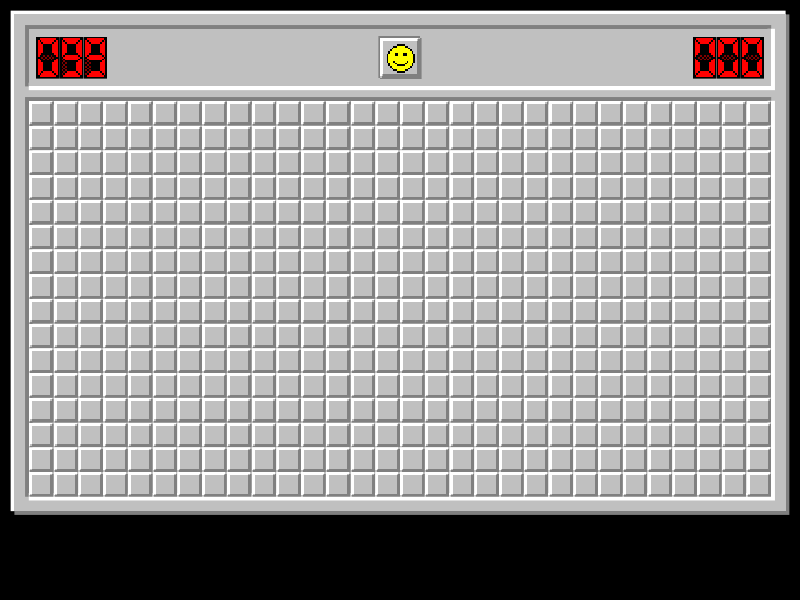

# minesweeper

<!-- badges: start -->
<!-- badges: end -->

Play minesweeper in R, replay your games and save them to GIF.

## Installation

You can install minesweeper with:

``` r
install.packages("minesweeper")
```

You can install the development version of minesweeper from
[GitHub](https://github.com/) with:

``` r
# install.packages("devtools")
devtools::install_github("hrryt/minesweeper")
```

## Example

``` r
library(minesweeper)
x11() # Unix-specific example
recording <- play_minesweeper()
replay_minesweeper(recording)
# install.packages("gifski")
save_minesweeper_gif(recording)
dev.off()
```


